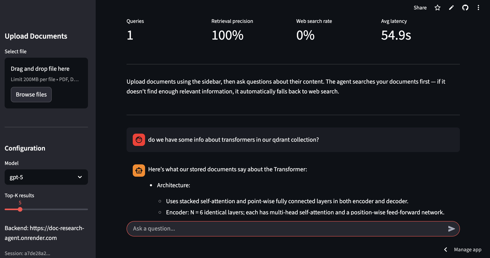
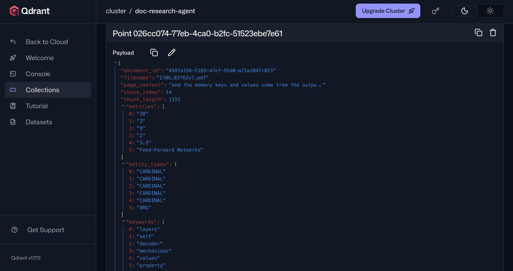

# Document Research Agent

An evidence-controlled RAG service. Upload documents, ask questions, get streamed answers
grounded in your files — with one live web-search fallback when the document evidence is not
sufficient.

Built on a **LangGraph** evidence workflow, **hybrid retrieval** (dense + BM25), a
**cross-encoder reranker**, persistent **conversation memory**, SSE token
**streaming**, local **guardrails**, and per-IP **rate limiting**.

**Frontend:** Streamlit · **Backend:** FastAPI on GCP Cloud Run · **Vector DB:** Qdrant

> **Full reference:** [`docs/architecture.md`](docs/architecture.md) explains every part —
> ingestion, retrieval, the evidence workflow, its state, the web-search
> fallback, streaming, guardrails, memory, evaluation, and deployment. Start there to
> understand how it works.

## Screenshots





## How it works (at a glance)

```
POST /api/stream
      │
   Guardrails (input: llm-guard Toxicity + PromptInjection, local)
      │
   ┌─── LangGraph evidence workflow ────────────────────┐
   │ query ─► retrieve ─► assess ─► answer               │
   │                         └──► web ─► assess ─► answer│
   │                                         └──► abstain│
   └─────────────────────────────────────────────────────┘
      │
   streamed answer tokens → SSE → client   +   outcome telemetry recorded
```

- **Query** — a tool-calling LLM turns the current conversation into one standalone document
  query; it cannot answer or call the web.
- **Tools** — `retrieve_documents` runs hybrid dense + BM25 search in Qdrant (fused with RRF),
  then a cross-encoder reranks a wide candidate pool down to your `top_k`; `web_search` hits
  the live web.
- **Evidence assessment** — a structured classifier validates whether the returned sources are
  sufficient. Insufficient document evidence gets one web fallback; still-insufficient evidence
  produces an honest abstention.
- **Answer** — only after sufficient evidence is found does the answer model write and stream
  the response. Internal source IDs are removed before the answer reaches the user;
  the final event includes only the validated citations those IDs selected, with document
  locations or web titles and URLs, plus a terminal stop reason; conversation history is
  persisted per session.

See [`docs/architecture.md`](docs/architecture.md) for the agent topology, the tools and state,
the web-search fallback walkthrough, and memory.

## Quickstart

```bash
cp .env.example .env     # fill in OPENAI_API_KEY, OPENROUTER_API_KEY, Qdrant settings
make up                  # boot Qdrant + the API via docker compose
make ui                  # run the Streamlit UI (separate terminal)
```

### Containerized development with hot reload

```bash
make dev-compose
```

This one command starts Qdrant, Jaeger, the FastAPI service, and Streamlit. Open the UI at
`http://localhost:8501`; the API remains at `http://localhost:8000`. `src/` and `ui.py` are
bind-mounted into their containers: Uvicorn reloads on backend edits and Streamlit reloads on
frontend edits. The first run builds the image; rebuild only after changing `Dockerfile`,
`pyproject.toml`, or `uv.lock`. Compose pins Qdrant to the same minor release as
`qdrant-client`, so the server and SDK stay within Qdrant's compatibility contract.

Local dev without Docker:

```bash
make install             # uv sync
make dev                 # uvicorn with reload
```

Useful targets: `make test`, `make eval` (full offline eval), `make eval-retrieval` (the
CI retrieval gate), `make lint`, `make format`.

## Configuration

Every field in `src/config.py` can be set via an env var of the same name; `.env` only needs
the values that differ per environment. See [`.env.example`](.env.example) for the annotated
list. Keys:

- `OPENAI_API_KEY` — embeddings (`text-embedding-3-small`) only
- `OPENROUTER_API_KEY` — all chat/LLM calls (the agent's reasoning + answer)
- `LLM_TIMEOUT_SECONDS` — maximum duration of one chat-model request (default `60`)
- `EMBEDDING_TIMEOUT_SECONDS` — maximum duration of one OpenAI embedding request (default `30`);
  transient OpenAI rate-limit/server failures retry up to `EMBEDDING_MAX_RETRIES` (default `2`)
- `QDRANT_MODE` — `local` (Docker) or `cloud` (uses `QDRANT_CLOUD_URL` + `QDRANT_API_KEY`);
  Compose sets this to `local` for its Qdrant service.
- `QDRANT_QUERY_TIMEOUT_SECONDS` — maximum duration of one retrieval request (default `10`);
  transient Qdrant failures retry once before the normal web-fallback path
- `QDRANT_INGESTION_TIMEOUT_SECONDS` — maximum duration of a collection/indexing request
  (default `30`)

Guardrails run locally (llm-guard) and need no API key. Conversation memory and live telemetry
use SQLite under `DATA_DIR` (default `./data`). The app also supports optional Postgres backends
when durable, shared state is needed.

## API

| Endpoint | Purpose |
|---|---|
| `POST /api/stream` | RAG query, streamed via SSE (`{question, session_id?, model?, top_k?}`) |
| `POST /api/upload` | ingest a document (`.pdf` / `.docx` / `.txt`) |
| `GET /api/monitoring/stats` | live query telemetry |
| `GET /health` | liveness |

## Evaluation

`evals/` holds an offline quality gate that runs the real retrieval pipeline against a labelled
golden set and scores retrieval, generation, and embeddings (details in
[`evals/README.md`](evals/README.md)). The deterministic retrieval tier runs in CI on every
push to main. The graph's document-answer, web-fallback, and abstention routes are covered by
corpus-backed integration tests; `make eval-graph` manually checks live graph outcomes and
citations against the same corpus. Use `uv run python -m evals.run_graph_eval --limit 3` for a
short live smoke run. Live telemetry reports aggregate outcome rates.

## Tech stack

**LangGraph** (evidence workflow + SQLite/Postgres checkpointer) · **LangChain** · **Qdrant** (hybrid dense +
BM25) · **FastEmbed** (BM25 sparse + cross-encoder reranker) · **llm-guard** (local input
guardrails) · **FastAPI** · **slowapi** (rate limiting) · **OpenAI** (embeddings) ·
**OpenRouter** (LLMs) · **PyMuPDF** · **spaCy** · **Streamlit** · **Docker** · **Terraform**
